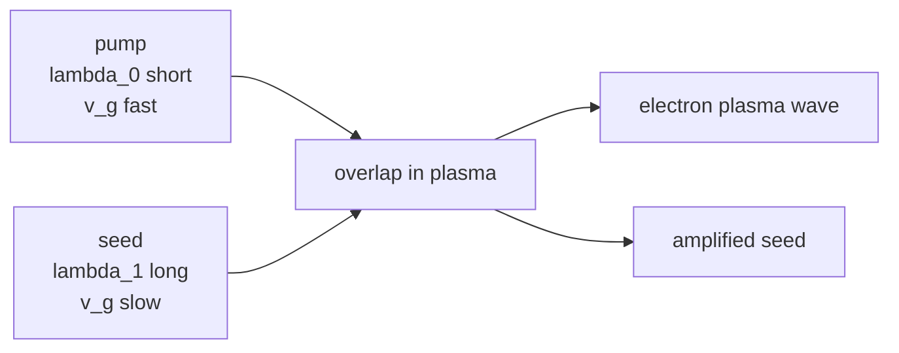

# 前向拉曼放大的理论复现

三波耦合动力学、时间尺度约束与级联波长拓展

---
layout: agenda
---

# 报告路线

1. 研究对象：FRA 的最小物理图像
2. Task 1：RFS / RBS 线性增长率与 Bessel 解
3. Task 3：四个时间尺度约束与可行工作区
4. Task 4：级联 FRA 的密度调谐与波长拓展
5. 结论：为什么这一路线具备物理可行性

---
layout: section
---

# 研究对象

把前向 Raman 散射从“不稳定性”转化为“主放大机制”

---

# FRA 的最小物理图像

**几何结构**

- 泵浦光和种子光同向传播
- 泵浦波长更短，频率更高
- 等离子体中 $v_{g,0}>v_{g,1}$
- 泵浦从后方追上种子并转移能量

<Block type="info">
核心问题不是“FRA 是否能增长”，而是它能否在成丝等不稳定性充分发展之前完成放大与自压缩。
</Block>

---

# 三波共振关系

FRA 使用电子等离子体波作为能量与动量匹配的中介：

$$
\omega_0=\omega_1+\omega_{pe},
\qquad
k_0=k_1+k_2.
$$

光波在冷等离子体中的色散关系为：

$$
\omega^2=\omega_{pe}^2+c^2k^2,
\qquad
v_g=c\sqrt{1-\frac{\omega_{pe}^2}{\omega^2}}.
$$

<Block type="warning">
种子光不是从噪声中凭空产生的；它是外部注入并选择在 Raman Stokes 分支上，因此可被受激放大。
</Block>

---
layout: section
---

# Task 1

从冷等离子体色散关系推导 RFS / RBS 线性增长率

---

# Task 1 的目标

**要复现的结果**

1. RFS 与 RBS 的完整线性增长率
2. 低密度极限下的近似公式
3. 中等密度下增长率比值的变化
4. 典型参数下的数值结果
5. 线性阶段 Bessel 解的物理含义

**关键参数**

$$
\mu=\frac{n_e}{n_{c0}}
=\frac{\omega_{pe}^2}{\omega_0^2},
\qquad
s=\sqrt{\mu}.
$$

典型复现点：

$$
\lambda_0=1.0\ \mu{\rm m},\quad
a_0=0.0854,\quad
\mu=0.2.
$$

---

# 从色散关系得到三波波数

泵浦光波数：

$$
k_0=\frac{1}{c}\sqrt{\omega_0^2-\omega_{pe}^2}.
$$

Raman Stokes 种子满足 $\omega_1=\omega_0-\omega_{pe}$，因此：

$$
|k_1|=\frac{1}{c}\sqrt{(\omega_0-\omega_{pe})^2-\omega_{pe}^2}
=\frac{1}{c}\sqrt{\omega_0^2-2\omega_0\omega_{pe}}.
$$

前向与后向的区别全部进入 $k_2$：

$$
k_{2,\rm RFS}=k_0-k_1,\qquad
k_{2,\rm RBS}=k_0+|k_1|.
$$

---

# RFS / RBS 的完整增长率

三波线性增长率写为：

$$
g=\frac{a_0ck_2}{4}
\sqrt{\frac{\omega_{pe}}{\omega_0-\omega_{pe}}}.
$$

于是：

$$
g_{\rm RFS}=
\frac{a_0}{4}
\left[\sqrt{\omega_0^2-\omega_{pe}^2}
-\sqrt{\omega_0^2-2\omega_0\omega_{pe}}\right]
\sqrt{\frac{\omega_{pe}}{\omega_0-\omega_{pe}}},
$$

$$
g_{\rm RBS}=
\frac{a_0}{4}
\left[\sqrt{\omega_0^2-\omega_{pe}^2}
+\sqrt{\omega_0^2-2\omega_0\omega_{pe}}\right]
\sqrt{\frac{\omega_{pe}}{\omega_0-\omega_{pe}}}.
$$

---

# 密度依赖形式

令 $\mu=n_e/n_{c0}$，则：

$$
g_{\rm RFS}=
\frac{a_0\omega_0}{4}
\left[\sqrt{1-\mu}-\sqrt{1-2\sqrt{\mu}}\right]
\sqrt{\frac{\sqrt{\mu}}{1-\sqrt{\mu}}},
$$

$$
g_{\rm RBS}=
\frac{a_0\omega_0}{4}
\left[\sqrt{1-\mu}+\sqrt{1-2\sqrt{\mu}}\right]
\sqrt{\frac{\sqrt{\mu}}{1-\sqrt{\mu}}}.
$$

<Block type="info">
传播要求 $1-2\sqrt{\mu}>0$，因此这里的 Raman Stokes 分支要求 $\mu<0.25$。
</Block>

---

# 低密度极限

当 $s=\sqrt{\mu}\ll1$：

$$
\sqrt{1-s^2}\simeq1-\frac{s^2}{2},
\qquad
\sqrt{1-2s}\simeq1-s-\frac{s^2}{2}.
$$

因此：

$$
g_{\rm RFS}\simeq
\frac{a_0\omega_0}{4}s^{3/2}
=
\frac{a_0\omega_{pe}}{4}
\sqrt{\frac{\omega_{pe}}{\omega_0}},
$$

$$
g_{\rm RBS}\simeq
\frac{a_0\omega_0}{2}\sqrt{s}
=
\frac{a_0}{2}\sqrt{\omega_{pe}\omega_0}.
$$

低密度下：

$$
\frac{g_{\rm RFS}}{g_{\rm RBS}}
\simeq
\frac{1}{2}\sqrt{\frac{n_e}{n_{c0}}}.
$$

---

# 中等密度下 RFS 变得有竞争力

精确比值为：

$$
\frac{g_{\rm RFS}}{g_{\rm RBS}}=
\frac{\sqrt{1-\mu}-\sqrt{1-2\sqrt{\mu}}}
{\sqrt{1-\mu}+\sqrt{1-2\sqrt{\mu}}}.
$$

当 $\mu\to0.25$：

$$
\sqrt{1-2\sqrt{\mu}}\to0,
$$

所以 $g_{\rm RFS}/g_{\rm RBS}\to1$。

**物理意义**

- 低密度下，前向散射 $k_2$ 小，增长慢
- 中等密度下，RFS 与 RBS 的增长率差距缩小
- 这为 FRA 作为主放大机制提供竞争性

---

# 典型参数数值复现

取论文 1D PIC 量级参数：

$$
\lambda_0=1.0\ \mu{\rm m},\quad
a_0=0.0854,\quad
\mu=0.2.
$$

得到：

| 量 | 数值 |
|---|---:|
| $\omega_0$ | $1.8837\times10^{15}\ {\rm rad/s}$ |
| $g_{\rm RFS}$ | $2.06\times10^{13}\ {\rm s^{-1}}=20.6\ {\rm THz}$ |
| $g_{\rm RBS}$ | $4.41\times10^{13}\ {\rm s^{-1}}=44.1\ {\rm THz}$ |
| $g_{\rm RFS}/g_{\rm RBS}$ | $0.47$ |

<Block type="info">
在 $\mu=0.2$ 的中等密度区间，前向增长率已经接近后向增长率的一半，不再是低密度极限下的弱通道。
</Block>

---

# 增长率随密度变化

**作图公式**

$$
g_{\rm RFS,RBS}(\mu)=
\frac{a_0\omega_0}{4}
\left[
\sqrt{1-\mu}\mp\sqrt{1-2\sqrt{\mu}}
\right]
\sqrt{\frac{\sqrt{\mu}}{1-\sqrt{\mu}}}.
$$

其中减号对应 RFS，加号对应 RBS。

**读图要点**

- 横轴是 $\mu=n_e/n_{c0}$，左轴是增长率，右轴是 $g_{\rm RFS}/g_{\rm RBS}$
- 低密度下 $k_{2,\rm RFS}$ 很小，RFS 增长率远低于 RBS
- 密度升高后，前向 Stokes 波更接近截止，$k_{2,\rm RFS}$ 增大，二者差距缩小
- $\mu=0.2$ 时 $g_{\rm RFS}/g_{\rm RBS}\approx0.47$，说明 FRA 已不是弱副过程

---

# 线性增长因子随密度变化

由解析解得到强度增益因子：

$$
G_I(\mu;\zeta,\tau)=
I_0^2\!\left(
2g_{\rm RFS}(\mu)\sqrt{\zeta\tau}
\right).
$$

图中固定不同 $\zeta=\tau$，扫描密度 $\mu$。

<Block type="info">
这张图比增长率图更接近实验关心的量：在给定相互作用窗口内，种子强度最终能放大多少。
</Block>

**物理意义**

- $G_I$ 对 $g$ 是 Bessel 函数型敏感依赖
- 同一传播窗口内，密度提高会显著推高最终增益
- 但 $\mu$ 不能无限接近 $0.25$，否则种子传播和不稳定性约束会变强

---

# 线性阶段的 Bessel 解

在线性阶段，泵浦近似不耗尽，种子光满足：

$$
a_1(\zeta,\tau)=a_{10}I_0(2g\sqrt{\zeta\tau}).
$$

小参数展开：

$$
I_0(x)=1+\frac{x^2}{4}+\cdots,
\qquad
a_1\simeq a_{10}(1+g^2\zeta\tau+\cdots).
$$

大参数展开：

$$
I_0(x)\simeq\frac{e^x}{\sqrt{2\pi x}},
\qquad
a_1\simeq
a_{10}
\frac{\exp(2g\sqrt{\zeta\tau})}
{\sqrt{4\pi g\sqrt{\zeta\tau}}}.
$$

---

# 解析解给出的二维增益图

**作图公式**

$$
G_I(\zeta,\tau)
=
\left|
\frac{a_1}{a_{10}}
\right|^2
=
I_0^2(2g\sqrt{\zeta\tau}).
$$

取典型参数：

$$
g_{\rm RFS}=20.6\ {\rm ps^{-1}}.
$$

图中颜色表示 $\log_{10}G_I$。

**读图方式**

- 横轴 $\zeta$：种子脉冲内部时间坐标
- 纵轴 $\tau=x/v_1$：沿种子传播累积的作用时间
- 颜色越亮表示强度增益越高
- 等值线近似沿 $\zeta\tau={\rm const.}$ 排布

---

# 不同种子切片的对流增长

固定传播距离 $x$，观察实验室时间 $t$ 中种子不同切片的增长：

$$
G_I(x,t)=
I_0^2\!\left[
2g\sqrt{
\left(t-\frac{x}{v_1}\right)
\frac{x}{v_1}
}
\right].
$$

**读图要点**

- 更远的传播距离对应更大的 $\tau=x/v_1$
- 每条曲线表示在固定 $x$ 处看到的时间剖面
- 峰值随传播距离累积而升高，体现泵浦持续向种子输能
- 曲线前沿从弱增长开始，后沿进入更强的 Bessel 增益区
- 这更接近论文时空演化图中“脉冲沿传播方向逐步增强”的读法

---

# 实验室坐标下的时空强度分布

坐标变换：

$$
\tau=\frac{x}{v_1},\qquad
\zeta=t-\frac{x}{v_1}.
$$

因此：

$$
G_I(x,t)=
I_0^2
\left(
2g\sqrt{
\frac{x}{v_1}
\left(t-\frac{x}{v_1}\right)}
\right).
$$

虚线为种子特征线 $t=x/v_1$，其后方区域才满足 $\zeta>0$ 并发生线性放大。

**和论文图一的关系**

- 这不是 PIC 场图，而是解析线性解生成的 $x$-$t$ 增益图
- 虚线以前种子尚未到达，不能发生受激放大
- 虚线以后，泵浦与种子重叠时间增加，增益迅速累积
- 高增益区域向右上延伸，表示放大随传播距离推进

---

# Bessel 解与近似式的适用区间

令：

$$
x=2g\sqrt{\zeta\tau}.
$$

小信号阶段：

$$
I_0(x)\simeq1+\frac{x^2}{4}.
$$

大参数阶段：

$$
I_0(x)\simeq
\frac{e^x}{\sqrt{2\pi x}}.
$$

**物理意义**

- 早期不是立刻指数爆发，而是从二次项开始
- 当 $x=2g\sqrt{\zeta\tau}$ 足够大后，增长接近指数型
- 因此放大启动需要有限的时空重叠，但进入大参数区后会迅速增强

---

# 等增益线：为什么是 $\zeta\tau$ 控制增长

等增益近似对应：

$$
2g\sqrt{\zeta\tau}={\rm const.}
$$

也就是：

$$
\zeta\tau\simeq{\rm const.}
$$

因此，在同样目标增益下，较短的内部时间切片需要更长传播距离补偿。

**这给实验设计的启发**

- 想获得同一增益，可以增加等离子体长度，也可以选择更长有效种子切片
- 若相互作用窗口太短，系统停留在低增益区
- Task 3 中的 $\tau_{window}$ 约束本质上就是这张图的时间尺度版本

---
layout: statement
---

# Task 1 的结论

前向 Raman 增长不是在所有密度下都弱；当等离子体进入 $\mu\sim0.1-0.25$ 的中等密度区间时，RFS 与 RBS 的增长率差距显著缩小，这是 FRA 方案具备竞争力的线性动力学基础。

---
layout: section
---

# 非线性阶段

从线性增长进入泵浦耗尽与超辐射标度

---

# 三波非线性演化方程

当种子被放大到足够强时，泵浦不再能视为常数：

$$
\partial_\zeta a_0=\kappa_0a_1a_2,
\qquad
\partial_\tau a_1=\kappa_1a_0a_2,
\qquad
\partial_\zeta a_2=\kappa_2a_0a_1.
$$

其中：

$$
\kappa_0=\frac{1}{1-v_0/v_1},
\qquad
\kappa_1=-\frac{\omega_0}{\omega_1},
\qquad
\kappa_2=-1.
$$

引入自相似变量：

$$
\xi=2a_{0,0}\sqrt{\kappa_1\kappa_2\zeta\tau}.
$$

---

# 自相似解与强度演化

三波振幅可写为：

$$
a_0=a_{0,0}\cos\left(\frac{\tilde{\nu}}{2}\right),
\qquad
a_2=a_{0,0}\sqrt{\frac{\kappa_2}{\kappa_0}}
\sin\left(\frac{\tilde{\nu}}{2}\right),
$$

$$
a_1=a_{0,0}^2\kappa_1
\sqrt{\frac{\kappa_2}{\kappa_0}}
\frac{1}{\xi}\frac{d\tilde{\nu}}{d\xi}.
$$

辅助函数满足：

$$
\tilde{\nu}_{\xi\xi}+\frac{1}{\xi}\tilde{\nu}_{\xi}
=\sin\tilde{\nu}.
$$

因此，泵浦耗尽和等离子体波激发由同一个 $\tilde{\nu}(\xi)$ 控制。

---

# 非线性强度标度

对应强度为：

$$
|a_0|^2=a_{0,0}^2\cos^2\left(\frac{\tilde{\nu}}{2}\right),
$$

$$
|a_2|^2=a_{0,0}^2
\frac{\kappa_2}{\kappa_0}
\sin^2\left(\frac{\tilde{\nu}}{2}\right),
$$

$$
|a_1|^2=a_{0,0}^4\kappa_1^2
\frac{\kappa_2}{\kappa_0}
\frac{1}{\xi^2}
\left(\frac{d\tilde{\nu}}{d\xi}\right)^2.
$$

早期非线性阶段：

$$
a_1^2\approx
a_{0,0}^4a_{1,0}^2
(\kappa_1\kappa_2)^2
\delta(\zeta)^2\tau^2.
$$

<Block type="info">
这里给出超辐射标度的关键来源：种子强度对泵浦振幅呈 $a_{0,0}^4$ 依赖，因此 $I_{\rm seed}\propto I_{\rm pump}^2$。
</Block>

---

# 非线性阶段的三波能量交换

**这张图回答什么**

线性阶段只说明种子会长大；非线性阶段要看泵浦是否真的被耗尽。

**物理读法**

- 蓝线下降：泵浦能量被抽取
- 红线上升：种子获得能量并进入强放大
- 绿线建立：电子等离子体波作为能量转移中介
- 中间橙色区域对应泵浦耗尽主导的非线性阶段

<Block type="info">
FRA 的“放大”不是单纯数学增长，而是泵浦光子通过等离子体波被转换成 Stokes 种子光子。
</Block>

---

# 能量账本：Manley-Rowe 关系

简化三波模型保留能量交换不变量：

$$
|a_0|^2+|a_1|^2\simeq{\rm const.},
\qquad
|a_0|^2+|a_2|^2\simeq{\rm const.}
$$

**物理意义**

- 不变量近似不变，说明图中增长来自能量重分配
- 泵浦耗尽分数上升，表示进入非线性能量转移区
- 这页可作为模型可信度检查，而不是主要结果图

---

# 泵浦耗尽与种子增强的时空图

**和线性时空图的区别**

- 左图显示泵浦强度被局域耗尽
- 右图显示种子在同一区域获得强放大
- 虚线是种子特征线 $t=x/v_1$
- 高增益区沿传播方向推进，形成能量转移前沿

<Block type="warning">
这张图最适合解释“非线性阶段发生在哪里”：不是整段等离子体同时放大，而是在泵浦-种子重叠区局域地完成能量转移。
</Block>

---

# 等离子体波是能量转移的中介

**为什么要画 $|a_2|^2$**

如果只看泵浦和种子，容易误以为是普通光学叠加；但 Raman 放大的关键是电子等离子体波。

**物理意义**

- $a_2$ 在泵浦-种子重叠处被拍频驱动
- 它相当于移动折射率光栅
- 该光栅把泵浦散射到种子频率与方向
- $a_2$ 的局域增强标记了能量转移发生的位置

---

# 超辐射标度：输出对泵浦强度极敏感

早期非线性结果给出：

$$
a_1^2\propto a_{0,0}^4,
$$

而 $I_{\rm pump}\propto a_{0,0}^2$，所以：

$$
I_{\rm seed}\propto I_{\rm pump}^2.
$$

**物理意义**

- 泵浦强度的小幅提升会带来种子输出的二次增强
- 这解释了 FRA 进入非线性阶段后的强放大潜力
- 但它也暗示 Task 3 的成丝约束会更严苛

---

# 相互作用长度：增长、耗尽、饱和

**实验设计问题**

等离子体长度不能只追求更长：

- 太短：泵浦还没充分耗尽，增益不足
- 合适：种子快速增强，转换效率上升
- 过长：增益趋于饱和，后续可能由成丝、相位失配或自压缩主导

<Block type="info">
这张图把非线性动力学和 Task 3 的时间尺度约束连接起来：最佳长度应落在“充分耗尽但不让不稳定性主导”的窗口。
</Block>

---
layout: section
---

# Task 3

四个时间尺度共同决定 FRA 的可行工作区

---

# 为什么只看增长率不够

FRA 的可行性由“能不能足够快地完成有用过程”决定：

| 时间尺度 | 含义 | 角色 |
|---|---|---|
| $\tau_{RFS}$ | 前向 Raman 线性放大时间 | 必须短 |
| $\tau_{window}$ | 泵浦追上并有效作用种子的时间窗口 | 必须足够长 |
| $\tau_{fil}$ | 成丝不稳定性增长时间 | 必须更长 |
| $\tau_{sfc}$ | 放大后种子自压缩时间 | 必须早于成丝 |

核心约束：

$$
\tau_{RFS}<\tau_{window}<\tau_{fil},
\qquad
\tau_{sfc}<\tau_{fil}.
$$

---

# 四个时间尺度的表达式

线性放大时间：

$$
\tau_{RFS}=g^{-1}.
$$

有效相互作用窗口：

$$
\tau_{window}
=
\frac{\tau_{pump}}{\beta_0-\beta_1},
\qquad
\beta_j=\frac{v_{g,j}}{c}.
$$

成丝时间：

$$
\tau_{fil}
=
\frac{8\omega_0}{\omega_{pe}^2a_0^2}
=
\frac{8}{\mu\omega_0a_0^2}.
$$

自压缩时间：

$$
\tau_{sfc}
=
\frac{cD}{2\omega_0v_{g,seed}}
=
\frac{D}{2\omega_0\beta_1}.
$$

---

# 自压缩距离参数

若以种子光临界密度定义：

$$
\chi=\frac{n_e}{n_{c,seed}}
=
\frac{\mu}{(1-\sqrt{\mu})^2},
$$

则：

$$
D=
\frac{\pi T_0^2}{2}
\frac{1}{\chi}
\left[
\frac{1-\chi}{\delta-1}
\right]^{3/2},
\qquad
\delta=\frac{\lambda_{seed}}{\lambda_{pump}}.
$$

<Block type="warning">
Task 3 的重点是参数平面上的可行区，而不是单个参数点是否增长；成丝时间给出了泵浦强度的上限。
</Block>

---

# 可行区：下限与上限

由 $\tau_{RFS}<\tau_{window}$ 得到泵浦振幅下限：

$$
a_0>a_{min}(\mu),
$$

$$
a_{min}(\mu)=
\frac{4(\beta_0-\beta_1)}
{\omega_0\tau_{pump}
\left[\sqrt{1-\mu}-\sqrt{1-2\sqrt{\mu}}\right]
\sqrt{\sqrt{\mu}/(1-\sqrt{\mu})}}.
$$

由 $\tau_{window}<\tau_{fil}$ 得到一个上限：

$$
a_0<a_{fil,window}(\mu)
=
\sqrt{
\frac{8(\beta_0-\beta_1)}
{\mu\omega_0\tau_{pump}}
}.
$$

---

# 可行区：自压缩约束

由 $\tau_{sfc}<\tau_{fil}$ 得到另一个上限：

$$
a_0<a_{fil,sfc}(\mu)
=
\sqrt{
\frac{8}
{\mu\omega_0\tau_{sfc}(\mu)}
}.
$$

因此 FRA 的工作区可以写为：

$$
0<\mu<0.25,
$$

$$
a_{min}(\mu)<a_0<
\min\left[
a_{fil,window}(\mu),
a_{fil,sfc}(\mu)
\right].
$$

<Block type="info">
这个表达式把“能放大”“能相互作用”“不先成丝”“能自压缩”统一到同一个 $(\mu,a_0)$ 参数平面。
</Block>

---

# 参考参数点验证

取论文 1D PIC 量级：

$$
\lambda_0=1.0\ \mu{\rm m},
\quad
a_0=0.0854,
\quad
\mu=0.2,
\quad
\tau_{pump}=240\ {\rm fs}.
$$

计算得到：

| 时间尺度 | 数值 |
|---|---:|
| $\tau_{RFS}$ | $0.0485\ {\rm ps}$ |
| $\tau_{window}$ | $0.782\ {\rm ps}$ |
| $\tau_{fil}$ | $2.92\ {\rm ps}$ |
| $\tau_{sfc}$ | $\sim0.4-0.5\ {\rm ps}$ |

结论：

$$
0.049\ {\rm ps}<0.78\ {\rm ps}<2.9\ {\rm ps},
\qquad
0.4-0.5\ {\rm ps}<2.9\ {\rm ps}.
$$

---

# 泵浦增强为何会压缩可行区

泵浦增强带来两个相反趋势：

$$
\tau_{RFS}\propto \frac{1}{a_0},
$$

说明更强泵浦会加快 Raman 放大。

但：

$$
\tau_{fil}\propto \frac{1}{a_0^2},
$$

说明成丝时间下降得更快。

<Block type="warning">
因此泵浦过强时，横向成丝会在放大和自压缩充分完成前发展起来，导致可行区随泵浦强度增大而收缩。
</Block>

---
layout: statement
---

# Task 3 的结论

FRA 不是单纯追求更高泵浦强度的方案；它要求 Raman 增长、群速度窗口、成丝不稳定性和自压缩过程之间保持严格的时间尺度排序。

---
layout: section
---

# Task 4

利用密度调谐设计级联 FRA 波长拓展方案

---

# 密度调谐的基本公式

FRA 共振给出种子波长：

$$
\lambda_{seed}
=
\frac{\lambda_{pump}}
{1-\sqrt{n_e/n_{c,pump}}}.
$$

若第 $j$ 级从 $\lambda_j$ 拓展到 $\lambda_{j+1}$，所需密度为：

$$
\mu_j
=
\frac{n_{e,j}}{n_{c,j}}
=
\left(1-\frac{\lambda_j}{\lambda_{j+1}}\right)^2.
$$

合理单级波长比：

$$
1.49\lesssim
\frac{\lambda_{j+1}}{\lambda_j}
\lesssim1.91,
\qquad
0.1\lesssim\mu_j\lesssim0.22.
$$

---

# 两级级联方案

| 级数 | 泵浦波长 | 种子波长 | $\delta$ | $n_e/n_{c,p}$ | 绝对密度 | 预期增益 |
|---|---:|---:|---:|---:|---:|---:|
| 1 | $1.0\ \mu{\rm m}$ | $1.8\ \mu{\rm m}$ | 1.80 | 0.198 | $2.2\times10^{20}\ {\rm cm^{-3}}$ | $\sim10^4$ |
| 2 | $1.8\ \mu{\rm m}$ | $3.2\ \mu{\rm m}$ | 1.78 | 0.191 | $6.6\times10^{19}\ {\rm cm^{-3}}$ | $10^2-10^4$ |

<Block type="info">
第一级输出的 $1.8\ \mu{\rm m}$ 种子可作为第二级泵浦，从而将近红外进一步拓展到中红外。
</Block>

---

# 三级拓展方案

进一步进入中红外：

$$
1.0\rightarrow1.8\rightarrow3.2\rightarrow5.6\ \mu{\rm m}.
$$

第三级：

$$
\lambda_{p,3}=3.2\ \mu{\rm m},
\qquad
\lambda_{s,3}=5.6\ \mu{\rm m},
\qquad
\delta_3=1.75.
$$

$$
\mu_3=
\left(1-\frac{1}{1.75}\right)^2
=0.184.
$$

由于：

$$
n_c(3.2\ \mu{\rm m})
=
\frac{1.115\times10^{21}}{3.2^2}
=1.09\times10^{20}\ {\rm cm^{-3}},
$$

得到：

$$
n_{e,3}\simeq2.0\times10^{19}\ {\rm cm^{-3}}.
$$

---

# 级联效率与真实衰减

单级非线性增益标度：

$$
G_j=
\frac{I_{s,j}^{out}}{I_{s,j}^{in}}
\propto
a_{p,j}^4\tau_j^2.
$$

理想总增益：

$$
G_{total}=G_1G_2G_3\cdots.
$$

真实情况下：

$$
G_{total,real}
=
\prod_j(\eta_jG_j).
$$

$\eta_j$ 包括泵浦耗尽不完全、光谱展宽、相位失配、密度阶梯边界损失、横向不稳定性和级间耦合损失。

---

# 群速度色散与相互作用长度

每一级的有效窗口：

$$
\tau_{window,j}
=
\frac{\tau_{p,j}}{\beta_{p,j}-\beta_{s,j}},
$$

其中：

$$
\beta_{p,j}=\sqrt{1-\mu_j},
\qquad
\beta_{s,j}=
\sqrt{
1-\frac{\mu_j}{(1-\sqrt{\mu_j})^2}
}.
$$

相互作用长度：

$$
L_{int,j}\simeq
c\beta_{s,j}\tau_{window,j}.
$$

同样 $\mu$ 下：

$$
g_j\propto a_{p,j}\omega_{p,j}
\propto
\frac{a_{p,j}}{\lambda_{p,j}}.
$$

因此波长越长，后级增长率越低，需要更长平台、更强泵浦或更长脉宽。

---
layout: statement
---

# Task 4 的结论

级联 FRA 的核心是用密度阶梯连续设定 Stokes 波长；中间级最好主要完成放大，最终一级再进行强自压缩，从而实现近红外到中红外的可调谐少周期强脉冲。

---
layout: section
---

# 总结

三个复现任务构成一条完整的可行性论证链

---

# 结论回顾

**Task 1**

中等密度下 RFS 与 RBS 增长率差距缩小，为前向放大提供线性动力学基础。

**Task 3**

FRA 可行区由 $\tau_{RFS}$、$\tau_{window}$、$\tau_{fil}$、$\tau_{sfc}$ 的排序共同决定。

**Task 4**

密度调谐允许构建级联 FRA，将 $1.0\ \mu{\rm m}$ 逐步拓展到中红外。

<Block type="info">
这三个任务分别回答：为什么能长大、在哪些参数下可行、如何进一步拓展波长。
</Block>

---
layout: references
---

# 参考文献

[[bibliography]]

---
layout: end
---

# 谢谢

Questions?
